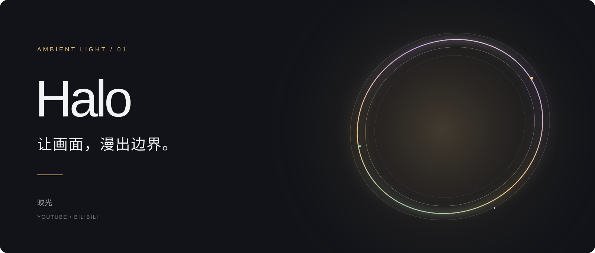
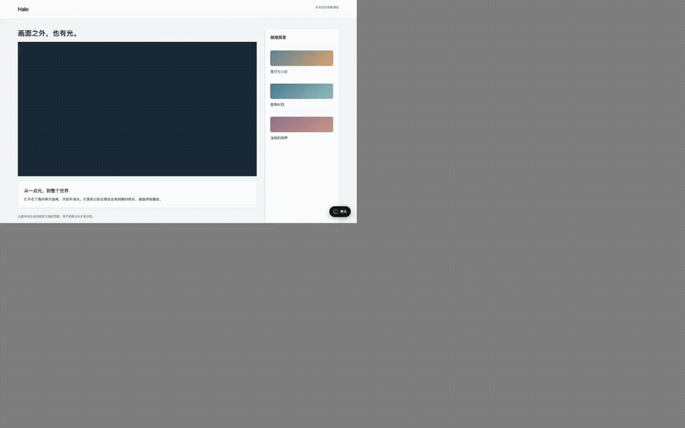
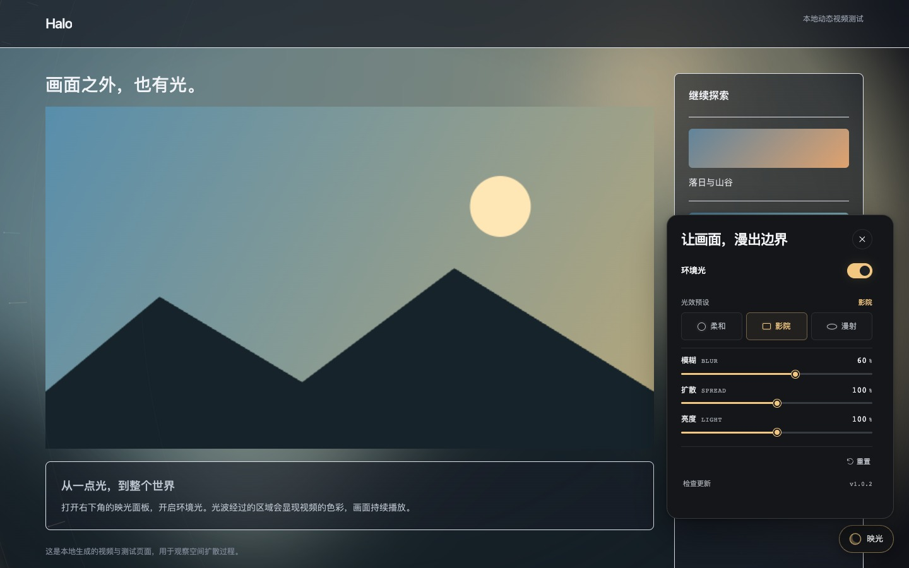
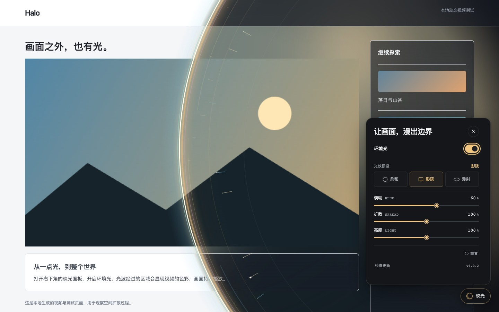

<div align="center">



<br />

[](https://github.com/Elys1an-Y1san/Halo/releases/latest)
[](https://github.com/Elys1an-Y1san/Halo/actions/workflows/checks.yml)
[](LICENSE)

**光从画面里生长，也从你的指尖展开。**

视频环境光扩展，为 YouTube 与哔哩哔哩打造连续的观看空间。

[安装指南](docs/INSTALL.md)　 /　 [发行版本](https://github.com/Elys1an-Y1san/Halo/releases)　 /　 [观看视频](docs/media/halo-demo.mp4)　 /　 [验证记录](docs/QA.md)

</div>

## 从一点光，到整个页面

开启环境光，金色与青紫色光环从开关位置向外推进。经过的区域同步显现新的背景、文字色彩和实时视频光晕；关闭时，光波收回，页面逐步还原。扩散使用同一个半径控制光环与真实渲染层，视频在整个过程中持续播放。



*本地动态视频测试页的真实运行录制。GIF 展示完整交互；[MP4 视频](docs/media/halo-demo.mp4)保留更清晰的画质。*

## 安静的面板，流动的画面



三种预设，三项调节：**柔和 / 影院 / 漫射**，**模糊 / 扩散 / 亮度**。两个网站分别保存设置，工具栏弹窗与页内面板共用界面与状态。

面板从悬浮按钮所在方向展开，关闭时轻轻退回。固定定位与横向溢出约束让开关光圈保持在面板内部；短窗口使用纵向滚动，滚动条不会挤动动画起点。连续点击会接续当前动画，焦点随面板开合移交。系统开启减少动态效果时，面板仅淡入淡出，整页光波直接完成状态切换。



## 文件夹即可安装

| 浏览器 | 安装文件 | 操作 |
| :-- | :-- | :-- |
| Chrome | [`Chrome/`](Chrome) | 扩展管理页开启开发者模式，加载已解压扩展 |
| Safari | [`Safari/Halo.app`](Safari) | 打开应用，在 Safari 扩展设置启用 |

仓库附带可用文件夹，无需先编译。Safari 构建使用本地开发签名，首次启用需要对应开发设置。详细步骤和更新方法见 [安装指南](docs/INSTALL.md)。

### 检查更新

点击面板底部「检查更新」，插件匿名查询本仓库的最新正式发行版。新版本链接只允许指向本仓库的 GitHub Release。查询包含超时、并发去重、六小时缓存与网络/限流错误处理；手动检查会刷新缓存。版本逐段比较，因此 `1.0.10` 正确大于 `1.0.2`。

设置存于浏览器本地。更新查询不会上传浏览网址，也不会自动安装或执行远程脚本。此独立发行默认关闭崩溃上报。

## 开发

需要 Node.js 22+、Python 3；Safari 原生构建还需要 macOS 与 Xcode。

```bash
cd Source
./build-chrome.sh         # 构建并生成 ../Chrome
./build-macos.sh          # 同时生成 ../Safari/Halo.app
```

只修改共享 UI、波动动画或 B 站适配时，可以复用附带的渲染核心：

```bash
cd Source
python3 package-halo.py
node --test tests/update.test.cjs
node tests/render-regression.cjs
node tests/bilibili-policy.test.cjs
python3 tests/package-check.py
python3 tests/ui-fixture/serve.py
```

浏览器打开 `http://127.0.0.1:8765/wave.html` 查看本地实时视频演示；测试入口与结果说明见 [QA](docs/QA.md)。

```text
Halo/
├── Chrome/              Chrome MV3 安装文件夹
├── Safari/              macOS 应用与 Safari 扩展
├── Source/              共享界面、渲染器、原生工程和测试
├── docs/media/          截图、GIF 和 MP4 演示
└── docs/                安装与验证说明
```

## 光效如何抵达页面

`HaloUI` 管理共享面板与可访问状态。`HaloWave` 将光波半径同步到实时环境光渲染层的圆形裁剪与页面材质。渲染器准备好后再次测量起点，使用扣除滚动条的视口尺寸。窗口改变、进入全屏或页面不可见时，完成当前切换并清理临时样式。

`HaloUpdates` 在扩展后台查询公开发行数据；页内脚本通过消息请求查询结果，域名权限只新增 `api.github.com`。接口依据 [GitHub Releases API](https://docs.github.com/en/rest/releases/releases#get-the-latest-release)，网络访问使用扩展的 [host permissions](https://developer.chrome.com/docs/extensions/develop/concepts/network-requests)。

## 开源致谢

YouTube 环境光渲染核心来自 [Wessel Kroos / youtube-ambilight](https://github.com/WesselKroos/youtube-ambilight/tree/18d17188e5562e5ee913f005192d30c9a60be078)，版本 2.38.17，遵循 MIT 许可。保留原版权与许可。映光添加独立界面、页内空间扩散、B 站适配、Safari 兼容修改与发行版查询。

[MIT License](LICENSE)。欢迎通过 [Issues](https://github.com/Elys1an-Y1san/Halo/issues)反馈可以复现的播放器与布局问题。
